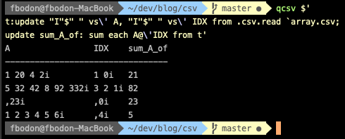
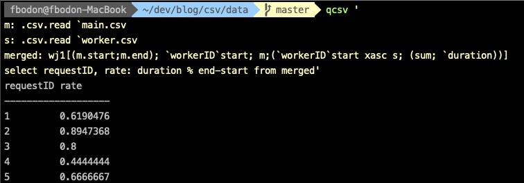

# Powerful CSV processing with kdb+

Comma-separated text files (CSV) are the most fundamental format for data processing. All programming languages and software that support working with relational data, also provide some level of CSV handling. You can persist and process data without installing a database management system. It is a lightweight form of storing, processing and sharing data.

The CSV format predates personal computers and has been one of the most common data exchange format for almost 50 years. CSV files will remain with us in the future. Working with this format efficiently is a core requirement of a productive developer, data engineer, DevOps person, etc…

In this article, I review available tools to process CSV files and then show how kdb+ and its query language q raise CSV processing to a new level of performance and simplicity.

## Linux command-line tools
Linux shells, like Bash, support arrays. You can read a CSV line-by-line and store all fields in an array variable. You can use built-in string manipulation and integer calculations (even float calculations with e.g `bc -l`) to operate on cell values. The code will be lengthy and hard to maintain.

General text processing tools like [`awk`](https://en.wikipedia.org/wiki/AWK) and [`sed`](https://en.wikipedia.org/wiki/Sed) scripts may result in shorter and simpler code. Commands like [`cut`](https://en.wikipedia.org/wiki/Cut_(Unix)), [`sort`](https://en.wikipedia.org/wiki/Sort_(Unix)), [`uniq`](https://en.wikipedia.org/wiki/Uniq) and [`paste`](https://en.wikipedia.org/wiki/Paste_(Unix)) further simplify CSV processing. You can specify the separator and **refer to fields by positions**.

The world is constantly changing. So do CSV files. Position-based reference breaks if a new column is added ahead of the referred column or columns are shuffled e.g. to move related columns next to each other. The problem manifests silently: your scripts may run smoothly, but you just use a different column in your calculation! If you don’t have a regression-testing framework to safeguard your codebase, then the end-user (or your competitor) might discover the problem. This can be embarrassing.

Position-based reference creates fragile code. Processing CSV by these Linux commands is great for prototyping and for quick analysis but you hit the limits once your codebase starts increasing or you share scripts with other colleagues. No wonder that in SQL the position-based column reference is limited and discouraged.

You can **refer to a column by name**. The column names are stored in the first row of the CSV. Reference by name is sensitive to column renaming but this probably happens less frequently than adding or reshuffling columns.

The huge advantage of Linux command-line tools is that no installation is required. Your shell script will likely run on other's Linux systems. Get familiar with Linux tools but refrain from using them in complex tasks. Remember that the separator is specified by `-t` command-line option for [`sort`](https://en.wikipedia.org/wiki/Sort_(Unix)) and `-d` for the other commands, [`cut`](https://en.wikipedia.org/wiki/Cut_(Unix)), [`paste`](https://en.wikipedia.org/wiki/Paste_(Unix)).

## CSVKit

Many open-source libraries on GitHub offer CSV support. Python library [CSVKit](https://csvkit.readthedocs.io/en/latest/#) is one of the most popular. It offers a more robust solution than native Linux commands. Most importantly, CSVKit commands allow reference by column name.

Also, they handle the first rows better than the general-purpose text tools do. Linux command `sort` treats the first row as any other row and can place it in the middle of the output. Similarly, `cat` includes the first rows when you concatenate multiple CSV files. Commands `csvsort` and `csvstack` handle first rows as properly.

Finally, the CSVKit developers took special care to provide consistent command-line parameters, e.g. separator is defined by `-d`.

The naming is coherent, [`csvcut`](https://csvkit.readthedocs.io/en/latest/scripts/csvcut.html), [`csvgrep`](https://csvkit.readthedocs.io/en/latest/scripts/csvgrep.html) and [`csvsort`](https://csvkit.readthedocs.io/en/latest/scripts/csvsort.html) replace traditional Linux commands `cut`, `grep` and `sort`. Nonetheless, the merit of the Linux commands is their speed, probably because they were written in C.

You probably use Linux commands [`head`](https://en.wikipedia.org/wiki/Head_(Unix)), [`tail`](https://en.wikipedia.org/wiki/Tail_(Unix)), [`less`](https://en.wikipedia.org/wiki/Less_(Unix))/[`more`](https://en.wikipedia.org/wiki/More_(command)) and [`cat`](https://en.wikipedia.org/wiki/Cat_(Unix)) to take a quick look at the content of a text file. Unfortunately, the output of these tools is not appealing for CSV files. The columns are not aligned and you will spend a lot of time squinting a monochrome screen figuring out to which column a given cell belongs. You might give up and import the data into Excel or Google Sheet. However, if the file is on a remote machine you first need to SCP it to your desktop. You can save time and work in the console by using [`csvlook`](https://csvkit.readthedocs.io/en/latest/scripts/csvlook.html). Command `csvlook` nicely aligns column under the column name.

```bash
$ csvlook --max-rows 20 data.csv
```

Don’t worry if your console is narrow: pipe the output to `less -S` and use arrow keys to move left and right.

Another useful extension of CSV tools is command [`csvstat`](https://csvkit.readthedocs.io/en/latest/scripts/csvstat.html). It analyzes the content and displays statistics like the number of distinct values of all columns. Also, it tries to infer types. If the column type is a number then it also returns maximum, minimum, mean, median, and standard deviation of the values.

To perform aggregations, filtering and grouping, you can use the generic command [`csvsql`](https://csvkit.readthedocs.io/en/latest/scripts/csvsql.html) that lets you run ANSI SQL commands on CSV files.

## xsv

Some CSVKit commands are slow because they load the entire file into the memory and create an in-memory database. Rust developers reimplemented several traditional tools like `cat`, `ls`, `grep` and `find` and tools like [`bat`](https://github.com/sharkdp/bat), [`exa`](https://github.com/ogham/exa), [`ripgrep`](https://github.com/BurntSushi/ripgrep) and [`fd`](https://github.com/sharkdp/fd) were born. No wonder they also created a performant tool for CSV processing, library [`xsv`](https://github.com/BurntSushi/xsv).

The library also supports selecting columns, filtering, sorting and joining CSV. An index can be added to CSV files that are frequently processed to speed up operations. It is an elegant and lightweight step towards DBMS.


## Type inference
CSV is a text file and holds no type information for the columns. A string can be converted to a datatype based on its value. If all values of a column matches the pattern `YYYY.MM.DD` we can conclude that the column holds dates. But how shall we treat the literal 100000? Is it an integer, or a time 10:00:00? Maybe the source process only supports digits and omitted the time separators? In real life, information about the source is not always available and you need to reverse engineer the data. If all values of the column match `HHMMSS` string then we **can** conclude with high confidence that the column holds time values. We can follow two approaches to make a decision.

First, we could be strict, i.e. we predefine the pattern that any type needs to match. The patterns do not overlap. If time is defined as `HH:MM:SS` and integers as `[1-9][0-9]*` then 100000 is an integer.

Second, we could let patterns overlap and in case of conflict we choose the type with the smaller domain or based on some rules. This approach prefers time over int for 100000 if the time pattern also contains `HHMMSS`.

Library CSVKit implements the first approach.

## kdb+
Kdb+ natively supports tables that resemble to Pandas/R data frames. Exporting and importing CSV files is part of the core language. Table `t` can be saved in directory `dir` by command

```
q) save `:dir/t.csv
```

To chose a different name, e.g. `output.csv` then use the File Text operator `0:` for saving text and the utility [`.h.cd`](https://code.kx.com/q/ref/doth/#hcd-csv-from-data) to convert a kdb+ table to a list of strings

```
q) `output.csv 0: .h.cd t
```

You can also use [other separators](https://code.kx.com/q/ref/file-text/#prepare-text) than comma.

To import a CSV `data.csv`, specify the column types and the separator. The following command assumes the column names are in the first row.

```
q) ("JFDS* I"; enlist csv) 0:hsym `data.csv
```

The type encoding is available on the [kdb+ reference card](https://code.kx.com/q/ref/#datatypes), `I` stands for integer, `J` for long, `D` for date, etc. Use spaces to ignore columns. Character `*` denotes string.

Specifying types manually has high maintenance costs, is laborious for wide CSV files and is prone to error. Inserting a single new column can break the code.

Fortunately, Kx open-source libraries [csvutil](https://github.com/KxSystems/kdb/blob/master/utils/csvutil.q) and [csvguess](https://github.com/KxSystems/kdb/blob/master/utils/csvguess.q) offer a convenient and robust solution.

Script `csvutil.q` contains a function to load a CSV file, analyze its values, infer types and return a kdb+ table.

```
q) \l utils/csvutil.q
q) .csv.read `data.csv
```


Script `csvguess.q` lets you save a metadata about the columns into a text file. Developers can review and adjust the type column and use the metadata in production to load a CSV with correct types. The two scripts have different users. Data scientists prefer `csvutil.q` for ad hoc analyses. When IT staff configure a kdb+ CSV feed then they use the assisted metadata export and import feature of `csvguess.q`. The type hints provide a less error-prone solution than manually entering types for all columns.

### Type conversion

Library `csvutil.q` supports both type conversions. The strict mode is implemented by `.csv.basicread`. Function `.csv.read` checks more patterns to infer types.

Function `.csv.read` is just a wrapper around the general function `.csv.data` that accepts a filename and a meta-data table. The meta-data can be generated by `.csv.basicinfo` and `.csv.info` depending on the inference rule set we would like to employ.

```
q).csv.read
{[file] data[file; info[file]]}
```

The column meta-data table is a bit similar to `csvstat` output.


Each row belongs to a column and each field stores some useful information about the column, like name (`c`), inferred type (`t`), max width (`mw`), etc. Field `gr` short for *granularity* is particularly interesting as it gives hint how well the column values compresses and if it should be stored as enumeration (symbol in kdb+ parlance) rather than as strings.

You can control the number of lines to be examined for type inference by variable `READLINES`. The default value is 5555. The smaller this number the more chance of an inference rule to be coincidental. For example in sample table (that was also used in CSVKit tutorial) column `fips` matches the patter `HMMSS` for the first 916 rows, so we could infer time as type. The patter matching breaks from line 917 with values like `31067`. To disable partial file-based type inference, just change `READLINES`.

```
q) .csv.READLINES: count read0 `data.csv
```

## kdb+ based one-liners

Let us wrap the q interpreter and the load of `csvutil.q` into a simple shell function.

```bash
$ function qcsv { q -c 25 320 -s $(nproc --all) <<< 'system "l utils/csvutil.q";'"$1"; }
```

The `-c 25 320` command-line parameter modifies the default 25×80 console size to display wide tables better. Switch `-s` allocates multiple threads for parallel processing. We set this value to the number of cores in your machine. Use `$(sysctl -n hw.ncpu)` if you work on a Mac. You can verify the setting by executing

```
$ qcsv 'system "s"'
```

to display the number of worker threads allocated for `qcsv`.

This simple wrapper can easily achieve what `csvlook`, `csvcut`, `csvgrep` and `csvsort` are built for… and even more. For example,

```bash
$ qcsv '.csv.read10 `data.csv'
```

mocks `csvlook` and displays the first 10 rows of `data.csv` nicely aligned. You can pipe the output to `less -S` for wide tables.


Whenever you would like to see a leading or a trailing subset of a table, use the [sublist](https://code.kx.com/q/ref/sublist/) function.

```bash
$ qcsv '20 sublist .csv.read `data.csv'
```

### Filtering, selecting columns, sorting
Once we have a kdb+ table, we can use the full power of qSQL to do any data manipulation. To select columns

```bash
$ qcsv 'select nsn,item_name from .csv.read `data.csv'
```

Perhaps, you dislike the idea of devoting resources to analyze columns, load them into memory, then discard them. Good news! We have a shortcut.

In kdb+, function `.csv.infoonly` accepts a list of columns to restrict the column analyses. We can plug the output into the generic `.csv.read`.

```
$ qcsv '.csv.data[`data.csv; .csv.infoonly[`data.csv; `nsn`item_name]]'
```

We can employ complex criteria to select rows.

```bash
$ qcsv 'select from .csv.read `data.csv where tem_name like "RIFLE*", fips > 32000'
```

We can use q keywords `xasc` and `xdesc` to mock `csvsort`.

```bash
$ qcsv '`fips xdesc .csv.read `data.csv'
```

A fantastic feature of the Unix-based system is piping: pass the output from a command as the input to another command. CSVKit also follows this principle. Once the content of a CSV is converted to a kdb+ table, you probably want to stay in this place as the power of q offers a convenient and powerful data-processing environment.

In real life, however, it can happen that you need to execute a black-box script that accepts the input via STDIN. Our `qcsv` command can convert a kdb+ table to produce the required output. For example, in the command below we massage the input CSV via q function `massage` then send the output to command `blackboxcommand`.

```bash
$ qcsv '-1 .h.cd massage .csv.read `data.csv;' | blackboxcommand
```

Remember the trailing semi-colon if you want to process the standard input.

### Indexing
The index feature of xsv speeds up queries by creating a binary file with extension `idx` next to the CSV.

```bash
$ xsv index data.csv
```

You can get a huge performance improvement if you convert the CSV to the proprietary kdb+ format and you can get further gain if you add indices to  columns you query often. In the command below, I create the kdb+ equivalent of `data.csv` as table `t` in directory `kdb` and apply an index on column `county`

```bash
$ mkdir db
$ qcsv '`:db/t/ set .Q.en[hsym `db] update `g#county from .csv.read `data.csv'
```

You don't need the `qcsv` wrapper around the q interpreter to run queries.

```bash
$ q db <<< 'select count i by county from t'
```

If we have limited hardware resources and the CSV does not fit into the memory, then we can use `csvguess.q` that supports batch loading and saving.

```bash
$ q csvguess.q data.csv -savescript -exit
$ q data.load.q -bulksave -savedb kdb -savename t -exit
```

Note that kdb+ is a columnar database and each column has its own file representation. When you run query `select count i by county from t` then only column `county` is read and requires resources. This lets you run queries on tables that do not fit into the memory and `csvsql` fails to run.

## Exotic functions
**qSQL is a superset of ANSI SQL**. With our one-liner `qcsv` we can express complex logic that ANSI SQL cannot handle. Furthermore, qSQL is just a part of the q programming language. All the features, libraries and functions of q are available to further massage a CSV file. These include vector operations, functional programming, advanced iterators, date/time and string manipulation, etc.

Furthermore, we can load the business logic that we use in production. **It is like employing the stored procedures of our DBMS to analyze a local CSV. Kdb+ provides a single solution for streaming, in-memory, historic data processing that you can also leverage in your ad hoc data analyses.**

The possibilities do not end here. Besides loading existing scripts you can also connect to existing kdb+ services easily. For example to evoke q function `fn` on a remote kdb+ server at e.g. `72.7.9.248:5001` with parameter of the content of the CSV, you can use make use of the [one-shot](https://code.kx.com/q/basics/ipc/#sync-request-get) TCP request.

```bash
qcsv '`:72.7.9.248:5001 (`fn; .csv.read `data.csv)'
```

With kdb+ you get full flexibility to plug scripts and services into a one-liner to process a CSV file. Simple and powerful, right?

Let us examine three areas to get a feel for how far you can go in analyzing CSV files.

### Pivot
Pivoting a table is a frequently-used function in data analyses. It provides a more compact view of the data by transforming column values to new columns. The new view allows for examining related values side-by-side. The technique is often used to visualize the output of aggregation with multiple grouping.

I put a wrapper function around when most [wide-spread pivot implementation](https://code.kx.com/q/kb/pivoting-tables/#a-very-general-pivot-function-and-an-example) into `utils/pivots.q`. All we need is to load library `pivot.q` and prepend `.pvt.pivotSingle`. It requires a [keyed table](https://code.kx.com/q4m3/8_Tables/#84-primary-keys-and-keyed-tables), typically the result of aggregation with multiple group-bys. The pivot column is the last key column. See how pivoting converts a narrow, hard-to-digest table to a square-shaped format that nicely fits the console.


### Array columns
Nothing prevents you putting a list of values into a cell of a CSV. You just need to use a separator other than a comma, e.g. whitespace or semicolon. Unlike ANSI SQL, kdb+ can handle array columns.

We already used function [.h.cd](https://code.kx.com/q/ref/doth/#hcd-csv-from-data) to convert a kdb+ table to a list of strings before saving that to a CSV. `.h.cd` handles array columns as expected. You can set the secondary delimiter via [.h.d](https://code.kx.com/q/ref/doth/#hd-delimiter). Bear in mind a string in q is a list thus `.h.cd` will insert spaces between the characters. It is simpler to use operator [0:](https://code.kx.com/q/ref/file-text/#prepare-text) if the table contains string columns but not a list of other types.

When reading the array column of a CSV it will be stored as a string column. Kdb+ function [vs](https://code.kx.com/q/ref/vs/) (that abbreviates **v**ector from **s**tring) splits a string by a separator string.

```
q)" " vs "10 31 -42"
"10"
"31"
"-42"
```

You can convert a list of strings to a list of integers by integer cast, denoted by `"I"$`.

Like many functions in kdb+, `vs` can be used with either infix or bracket notation.

```
q) vs[" "; "10 31 -42"]
```

Kdb+ supports functional programming. You can easily apply a unary function to a list with `each`. This is similar to Python's `map` function. Furthermore, you can derive a unary function from a binary function by binding a parameter. This is called [projection](https://code.kx.com/q4m3/6_Functions/#64-projection). Putting this together we can split a list of strings by whitespaces as per

```
q) vs[" "] each ("10 31 -42"; "104 105 107")
"10"  "31"  "-42"
"104" "105" "107"
```

or more elegantly with the Each iterator (denoted by `'`) if the separator is a single character.

```
q) " " vs' ("10 31 -42"; "104 105 107")
```

A table column can be a list of strings. Suppose column `A` contains whitespace-separated integers. Function `.csv.read` returns a string column that we can easily convert to an array column.

```
q) update "I"$" " vs' A from .csv.read `data.csv
```

Just to illustrate the power of the q language, suppose `data.csv` has another array column called `IDX` containing indices. For each row, we need to calculate the sum of array column `A` restricted to the indices specified by `IDX`. Let me delve inside indexing a little bit.

In q you can index a list the same way as you do in other programing languages.

```
q) l: 4 1 6 3    // this is an integer list
q) l[2]
6
```

Q is a vector language. Many operators accept not only scalars but lists as well. Indexing is such an operation.

```
q) l[2 1]
6 1
```

The square brackets are just syntactic sugar. You can instead use the `@` operator with infix notation.

```
q) l @ 2 1
6 1
```

If we pass a list of lists as both arguments of the `@` operator then we need the Each iterator again. Putting it all together, we add new column `sum_A_of` by


```bash
$ qcsv $'
t:update "I"$" " vs\' A, "I"$" " vs\' IDX from .csv.read `data.csv;
update sum_A_of: sum each A@\'IDX from t'
```



I split the expression into multiple lines for readability, but from the shell’s perspective, it is still a single command.

The Each iterator (`'`) needs to be escaped and we need to use ANSI-C quoting, hence the `$` before the opening quotation mark.

### Join
Joining two CSV files is already supported by the Linux command `join`. Command `csvjoin` goes further and supports all types of SQL joins: inner, left, right and outer. Q also supports these classic join operations.

For timeseries another type of join is frequently used. This is called [asof](https://code.kx.com/q/ref/asof/) and its generalization [window join](https://code.kx.com/q/ref/wj/). If you have two streams of data and the times are different then asof join can merge the two streams.

Let me demonstrate the usage of window join in a real-life scenario to profile distributed processes. Our main process sends requests to worker processes. Each request results in multiple tasks. We store the `start` and `end` times of the requests and the `start` times and `duration` of the tasks. We would like to see the ratio of times the worker devoted to each request. Due to network delay, the start time of a task follows the start time of a request. An example of the main process’ data is below.

| requestID | workerID | start | end |
| ---: | ---: | ---: | ---: |
RQ1|SL1|12:31|12:52|
RQ2|SL2|12:31|12:50|
RQ3|SL1|12:54|12:59|
RQ4|SL3|12:51|13:00|
RQ5|SL1|13:10|13:13|

And merged workers data is

| workerID | taskID | start | duration |
| ---: | ---: | ---: | ---: |
|SL1|1|12:32|1|
|SL1|2|12:35|2|
|SL1|3|12:37|10|
|SL2|1|12:31|17|
|SL1|4|12:55|1|
|SL1|5|12:56|3|
|SL3|1|12:52|3|
|SL3|2|12:58|1|
|SL1|6|13:10|2|

Function `wj1` helps find the tasks with given workerID values that fall within a time window specified by the main table's `start` and `end` columns.

```
q) m: .csv.read `main.csv
q) s: .csv.read `worker.csv
q) wj1[(m.start;m.end); `workerID`start; m; (`workerID`start xasc s; (::; `taskID))]
requestID workerID start end   taskID
------------------------------------
1         sl1     12:31 12:52 1 2 3h
2         sl2     12:31 12:50 ,1h
3         sl1     12:54 12:59 4 5h
4         sl3     12:51 13:00 1 2h
5         sl1     13:10 13:13 ,6h
```

Character `h` at the end of the integer list in column `taskID` denotes the _short_ datatype, i.e. an integer is stored in one byte. Function `.csv.info` tries to save memory and use the integer and floating-point representation that requires the least space while preserving all information.

To get the ratio, we need to work with elapsed times.

```
q) select requestID, rate: duration % end-start from
     wj1[(m.start;m.end); `workerID`start; m;
       (`workerID`start xasc s; (sum; `duration))]
```



## Performance
Let us compare the performance of executing a simple aggregation on publicly available CSV used in benchmarking the `xsv` package. The 145 MByte file contains nearly 32 million lines.

```bash
$ curl -LO https://burntsushi.net/stuff/worldcitiespop.csv
```

We would like to see the top 10 regions by population. We need to sum the population of the cities of each region. Package xsv does not support aggregation, so it is out of the game.

The q query is simple.

```bash
$ qcsv '10 sublist `Population xdesc select sum Population by Region from .csv.basicread `worldcitiespop.csv'
```

The aggregation requires columns `Population` and `Region` only so we can speed up the query by omitting type conversion of the unused columns.

```bash
$ qcsv '10 sublist `Population xdesc select sum Population by Region from .csv.data[`worldcitiespop.csv; .csv.infoonly[`worldcitiespop.csv; `Population`Region]]
```

The `csvsql` is quite similar

```bash
$ csvsql --query "select Region, SUM(Population) AS Population FROM worldcitiespop GROUP BY Region ORDER BY Population DESC LIMIT 10" worldcitiespop.csv
```

Several other open-source tools run SQL statements on CSV files. I also evaluated two packages written in Go.

```bash
$ textql -header -sql "select Region, SUM(Population) AS Population FROM worldcitiespop GROUP BY Region ORDER BY Population DESC LIMIT 10" worldcitiespop.csv
```

The run times in seconds are displayed below. The second row corresponds to the experiment with the same CSV bloated by repeating its content five times.

| CSVKit | textql | csvq | kdb+ |
| ---: | ---: | ---: | ---: |
| 220 | 23 | 13 | 2 |
| OUT OF MEM | 102 | OUT OF MEM | 6 |

Kdb+ is famous for its stunning speed. Benchmarks tend to focus on data that resides either in-memory or on disk using its proprietary format. CSV support is a useful feature of the language. However, the extreme optimization, the support of vector operations and the inherent parallelization pays off: kdb+ significantly outperforms tools purpose-built for CSV analysis. The execution speed translates directly to productivity. How much does it cost you if the query returns in almost 4 minutes instead of 2 seconds? What do developers do if repeatedly interrupted by minutes-long wait phases?

The test ran on a `n1-standard-4` GCP virtual machine. The run times of the kdb+ solution would further drop with machines of more cores, as kdb+ 4.0 makes use of [multithreaded primitives](https://code.kx.com/q/kb/mt-primitives/).

## Conclusion
Many tools out there to process CSV files. Kdb+ has an excellent open-source library `csvutil.q`/`csvguess.q` with a sophisticated type-inference engine. Once you convert CSV into a kdb+ in-memory table, you can easily cope with problems other tools handle only with difficulty - if at all. You can express complex logic in a readable way that is easy to maintain and executes fast simply by wrapping the q interpreter that loads the library into a shell function.
