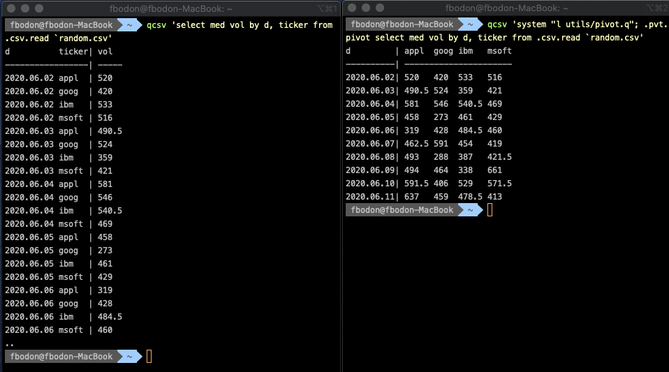

# Powerful CSV processing with kdb+

Comma-separated text files (CSV) are the most fundamental format for data processing. All programming languages and software that support working with relational data, also provide some level of CSV handling. You can persist and process data without installing a database management system. It is a light-way form of storing, processing and sharing data.

The CSV format predates personal computers and has been one of the most common data exchange format for almost 50 years. CSV files will remain with us in the future. Working with this format efficiently is a core requirement of a productive developer, data engineer, DevOps person, etc..

In this article I review available tools to process CSV files and then show how kdb+ raises CSV processing to a new level both in performance and in simplicity.

## Linux command line tools
Linux shells, like Bash, support array. You can read a CSV line-by-line and store all fields in an array variable. You can use built-in string manipulation and integer calculations (even float calculation with e.g `bc -l`) to operate on cell values. The code will be lengthy that hard to maintain.

General text processing tools like [awk](https://en.wikipedia.org/wiki/AWK) and [sed](https://en.wikipedia.org/wiki/Sed) scripts may result in shorter and simpler code. Commands like [cut](https://en.wikipedia.org/wiki/Cut_(Unix)), [sort](https://en.wikipedia.org/wiki/Sort_(Unix)), [uniq](https://en.wikipedia.org/wiki/Uniq) and [paste](https://en.wikipedia.org/wiki/Paste_(Unix)) further simplifies CSV processing. You can specify the separator and **refer to fields by positions**.

The world is constantly changing. So do CSV files. Position-based reference breaks if new a column is added ahead of the referred column or columns are shuffled e.g. to move related columns next to each other. The problem manifests silently, maybe your scripts run fine, you just use a different column in your calculation. If you don't have a regression testing framework to safeguard your codebase, then the end-user (or your competitor) might discover the problem. This can be embarrassing.

Position based reference creates fragile code. Processing CSV by these Linux commands is great for prototyping and to do a quick analyses but you bump into the limits once your codebase starts increasing or you share scripts with other colleagues. No wonder that in SQL the position based column reference is limited and discouraged.

You can **refer to a column by name**. The column names are stored in the first row of the CSV. Reference by name is sensitive to column renaming but probably this happens less frequently than adding or reshuffling columns.

The huge benefit of Linux command line tools is that no installation is required. Your shell script will likely run on other's Linux systems. Get familiar with Linux tools but refrain from using them in complex tasks. Remember that the separator is specified by `-t` command line option for [sort](https://en.wikipedia.org/wiki/Sort_(Unix)) and `-d` for the other commands, [cut](https://en.wikipedia.org/wiki/Cut_(Unix)), [paste](https://en.wikipedia.org/wiki/Paste_(Unix)).

## CSVKit

There are many open source libraries on Github with the aim of CSV support. Python library [CSVKit](https://csvkit.readthedocs.io/en/latest/#) is one of the most popular tools. It offers a more robust solution than native Linux commands. Most importantly, CSVKit commands allow reference by column name.

Also they are better in handling the first column separately than the general-purpose text tools. Linux command `sort` treats the first row as normal row and can place it in the middle of the output. Similarly `cat` is not skipping the first rows when you concatenate multiple CSV files. Commands `csvsort` and `csvstack` handle first rows as properly.

Finally, the CSVKit developers took special care to provide consistent command line parameters, e.g. separator is defined by `-d`.

The naming is coherent, [csvcut](https://csvkit.readthedocs.io/en/latest/scripts/csvcut.html), [csvgrep](https://csvkit.readthedocs.io/en/latest/scripts/csvgrep.html) and [csvsort](https://csvkit.readthedocs.io/en/latest/scripts/csvsort.html) replace traditional Linux commands `cut`, `grep` and `sort`. Nonetheless, the merit of the Linux commands is their speed, probably attributed to the fact that they were written in C.

You probably use Linux commands [head](https://en.wikipedia.org/wiki/Head_(Unix)), [tail](https://en.wikipedia.org/wiki/Tail_(Unix)), [less](https://en.wikipedia.org/wiki/Less_(Unix))/[more](https://en.wikipedia.org/wiki/More_(command)) and [cat](https://en.wikipedia.org/wiki/Cat_(Unix)) to take a quick look at the content of a text file. Unfortunately the output of these tools for CSV files is not appealing. The columns are not aligned and you will spend a lot of time squinting a black and white screen figuring out to which column a given cell belongs. You may give up and import the data into Excel or Google Sheet. However the file is on a remote machine so first you need to SCP the file to your desktop. You can save time and work in the console by using [csvlook](https://csvkit.readthedocs.io/en/latest/scripts/csvlook.html). Command `csvlook` nicely aligns column under the column name.

```bash
$ csvlook --max-rows 20 data.csv
```

Don't worry if your console is narrow, pipe the output to `less -S` and use arrow keys to move left and right.

Another useful extension of CSV tools is command [csvstat](https://csvkit.readthedocs.io/en/latest/scripts/csvstat.html). It analyzes the content and displays statistics like the number of distinct values of all columns. Also, it tries to infer types. If the column type is a number then it also returns max/min/mean/median/stddev of the values.

To perform aggregations, filtering and grouping, you can use the generic command [csvsql](https://csvkit.readthedocs.io/en/latest/scripts/csvsql.html) that lets you run ANSI SQL commands on CSV files.

## xsv

Some CSVKit commands are slow because they load the entire file into the memory and creates an in-memory database. Rust developers reimplemented several traditional tools like `cat`, `ls`, `grep` and `find` and tools like [bat](https://github.com/sharkdp/bat), [exa](https://github.com/ogham/exa), [ripgrep](https://github.com/BurntSushi/ripgrep) and [fd](https://github.com/sharkdp/fd) were born. No wonder that they also created a performant tool for CSV processing, library [xsv](https://github.com/BurntSushi/xsv).

The library also supports selecting column, filtering, sorting and joining CSV. An index can be added to CSV files that are frequently processed to speed up operations. It is an elegant and lightweight step towards DBMS.


## Type Inference
CSV is a text file, there is no type information associated with the columns. Strings can be converted to a type based on its value. If all values of a column matches the pattern `YYYY.MM.DD` then we can conclude that the column stores date. But how shall we treat the literal 100000? Is it an integer, or a time 10am? Maybe the upstream process only supports digits hence the time separators are missing? In real life, information about the upstream is not always available and you need to reverse engineering the data. If all values of the column matches `HHMMSS` string then we **can** conclude with high confidence that the column stores time values. We can follow two approaches to make a decision.

First, we can be strict, i.e. we predefine the pattern that any type needs to match. The patterns are not overlapping. If time is defined as `HH:MM:SS` and integers as `[1-9][0-9]*` then 100000 is an integer.

Second, we let patterns overlap and in case of conflict we choose the type with the smaller domain or based on some rules. This approach prefers time over int for 100000 if time pattern also contains `HHMMSS`.

Library CSVkit implements the first approach.

## kdb+
Kdb+ natively supports tables that resembles a bit to Pandas/R data frames. Exporting and importing CSV files is part of the core language. Table `t` can be saved by command

```
q) save `t.csv
```

If you would like to chose a different name e.g. `output.csv` and separator `|` then

```
q) `output.csv 0:"|"0: t
```

To import a CSV `data.csv`, you need to specify the column types and the separator. The following command assumes that the column names are in the first row.

```
q) ("JFDS* I";enlist",") 0:hsym `data.csv
```

The type encoding is available on the [kdb+ reference card](https://code.kx.com/q/ref/#datatypes), `I` stands for integer, `J` for long, `D` for date, etc. Use white spaces to ignore columns. Character `*` denotes string.

Specifying types manually has high maintenance costs, is laborious for wide CSV files and is prone to error. Inserting a single new column can break the code.

Fortunately, Kx open-source libraries [csvutil](https://github.com/KxSystems/kdb/blob/master/utils/csvutil.q) and [csvguess](https://github.com/KxSystems/kdb/blob/master/utils/csvguess.q) offer a convenient and robust solution.

Scripts `csvutil.q` contains function to load a CSV file, analyzes its values, infers types and return a kdb+ table.

```
q) \l utils/csvutil.q
q) .csv.read `data.csv
```


Scripts `csvguess.q` allows saving a meta-information about the columns. Developers can review and adjust the type column and use the meta-data in production to load CSV with proper type. The two scripts have different users. Data scientists prefer `csvutil.q` for their ad hoc analyses. When IT is setting up a kdb+ CSV feed then they use assisted meta-data export and import feature of `csvguess.q`. The type hints provides a less error prone solution than manually entering types for all columns.

### Type conversion

Library `csvutil.q` supports both type conversions. The strict mode is implemented by `.csv.basicread`. Function `.csv.read` checks more patterns to infer types.

Function `.csv.read` is just a wrapper around the general function `.csv.data` that accepts a filename and a meta-data table. The meta-data can be generated by `.csv.basicinfo` and `.csv.info` depending on the inference rule set we would like to employ.

```
q).csv.read
{[file] data[file; info[file]]}
q).csv.basicread
{[file] data[file; basicinfo[file]]}
```

The column meta-data table is a bit similar to `csvstat` output.


Each row belongs to a column and each field stores some useful information about the column, like name (`c`), inferred type (`t`), max width (`mw`), etc. Field `gr` short for *granularity* is particularly interesting as it gives hint how well the column values compresses and if it should be stored as enumeration (symbol in kdb+ parlance) rather than as string.

You can control the number of lines to be examined for type inference by variable `READLINES`. The default value is 5555. The smaller this number the more chance of an inference rule to be coincidental. For example in sample table (that was also used in CSVKit tutorial) column `fips` matches the patter `HMMSS` for the first 916 rows, so we could infer time as type. The patter matching breaks from line 917 with values like `31067`. To disable partial file-based type inference, just change `READLINES`.

```
q) .csv.READLINES: count read0 `data.csv
```

## kdb+-based one-liners

Let us wrap the q interpreter and the load of `csvutil.q` into a simple shell function.

```bash
$ function qcsv { q -c 25 320 -s $(nproc --all) <<< 'system "l utils/csvutil.q";'"$1" }
```

The `-c 25 320` command line parameter modifies the default 25x80 console size to better display wide tables. Switch `-s` allocates multiple slaves for parallel processing. We set this value to the number of cores in your machine. Use `$(sysctl -n hw.ncpu)` if you work on a Mac.

This simple wrapper can easily achieve what csvlook, csvcut, csvgrep and csvsort are built for... and even more. For example,

```bash
$ qcsv '.csv.read10 `data.csv'
```

mocks `csvlook` and displays nicely aligned the first 10 rows of `data.csv`.

Whenever you would like to see more lines, use the [take operator](https://code.kx.com/q/ref/take/) (`#`) that returns a leading or trailing subset of the entity on the right, let the entity be a table, a list or a dictionary. If you would like to help junior developers and DevOps understand your code, then you can use the more explicit [sublist](https://code.kx.com/q/ref/sublist/) keyword.

```bash
$ qcsv '20 sublist .csv.read `data.csv'
```

### Filtering, selecting columns, sorting
Once we have a kdb+ table, we can use the full power of q-sql to do any data manipulation. To select columns.

```bash
$ qcsv 'select nsn,item_name from .csv.read `data.csv'
```

If you are the type of person who has bad feelings for devoting resources to analyze columns (and load into memory) that we throw away. Good news, we can do a shortcut.

In kdb+, function `.csv.infoonly` accepts a list of columns to restrict the column analyses. We can plug the output to the generic `.csv.read`.

```
$ qcsv '.csv.data[`data.csv; .csv.infoonly[`data.csv; `nsn`item_name]]'
```

We can employ complex criteria to select rows.

```bash
$ qcsv 'select from .csv.read `data.csv where tem_name like "RIFLE*", fips > 32000'
```

We can use q keywords `xasc` and `xdesc` to mock `csvsort`.

```bash
$ qcsv '`fips xdesc .csv.read `data.csv'
```

## Exotic functions
**q-sql is the superset of ANSI SQL**. This means that with our one-liner `qcsv` we can express complex logic that ANSI SQL cannot handle. Furthermore, q-sql is the subset of the q programming language. We can employ all features, libraries and functions of q to further massage a CSV file. These include vector operations, functional programming, advanced iterator, date and time manipulation, etc.

Furthermore, we can load the business logic that we use in production. **It is like employing the stored procedures of our DBMS to analyze a local CSV. Kdb+ provides a single solution for streaming, in-memory, historic data processing that you can also leverage in your ad hoc data analyses.**

The possibilities do not end here. Besides, loading existing scripts, you can also connect to existing kdb+ services easily. For example to evoke q function `fn` on a remote kdb+ server at e.g. `72.7.9.248:5001` with parameter of the content of the CSV, you can use make use of the one-shot TCP request.

```bash
qcsv '`:72.7.9.248:5001 (`fn; .csv.read `data.csv)'
```

With kdb+ you get the full flexibility to plug scripts and services into a one-liner to process a CSV file. Simple and powerful, right?

Let us examine three areas to get a feel of how far you can go in analyzing CSV files.

### Pivot
Pivoting a table is a frequently used function in data analyses. It provides a more compact view of the data by transforming column values to new columns. The new view allows for examining related values side-by-side. The technique is often used to visualize the output of aggregation with multiple grouping.

I put some  wrapper function around when most [wide-spread pivot implementation](https://code.kx.com/q/kb/pivoting-tables/#a-very-general-pivot-function-and-an-example) into `utils/pivots.q`. All we need is to load library `pivot.q` and prepend `.pvt.pivotSingle`. It requires a [keyed table](https://code.kx.com/q4m3/8_Tables/#84-primary-keys-and-keyed-tables) , typically the result of an aggregation with multiple group bys. The pivot column is the last key column. See how pivotting converts a narrow, hard to digest table to a square shaped format that nicely fits the console.



### Array columns
Nothing prevents you technically to put a list of values into a cell of a CSV. You just need to use a separator other than a comma, e.g. whitespace or semicolon. Unlike ANSI SQL, kdb+ can handle array columns.

Kdb+ function `vs` (that abbreviates **v**ector from **s**tring) splits a string by a separator string.

```
q)" " vs "10 31 -42"
"10"
"31"
"-42"
```

You can convert a list of strings to a list of integers by integer cast, denoted by `"I"$`.

Like many functions in kdb+, `vs` can be either used in infix notation or as normal function.

```
q) vs[" "; "10 31 -42"]
```

kdb+ supports functional programming. You can easily apply a monadic function to a list via the `each` operator. This is similar to Python's function `map`. Furthermore you can derive a monadic function from a dyadic function by binding a parameter. This is called [projection](https://code.kx.com/q4m3/6_Functions/#64-projection) in kdb+ parlance. Putting this together we can split a list of strings by a whitespace as per

```
q) vs[" "] each ("10 31 -42"; "104 105 107")
"10"  "31"  "-42"
"104" "105" "107"
```

or more elegantly with operator `each both` (denoted by `'`) if the separator is a single character

```
q) " " vs' ("10 31 -42"; "104 105 107")
```

It is not a problem if the list of string is given as a column of a table. Let us assume that column `A` contains whitespace separated integers. Function `.csv.read` returns string column that we can easily convert to an array column.

```
q) update "I"$" " vs' A from .csv.read `data.csv
```

Just to illustrate the power of the q language, let us assume that `data.csv` contains another array column called `IDX` and contains indices. For each row we need to calculate the sum of array column `A` restricted to the indices specified by `IDX`. Let me delve inside indexing a little bit.

In kdb+ you can index a list the same way as you do in other programing language

```
q) l: 4 1 6 3    // this is an integer list
q) l[2]
6
```

kdb+ is a vector language. Many operations accepts not only scalars but lists as well. Indexing is such an operation.

```
q) l[2 1]
6 1
```

The square brackets are just syntactic sugar, you can also use the `@` operator with infix notation

```
q) l @ 2 1
6 1
```

If we pass list of lists to both sides of the `@` operator then we need the `each both` construct again. Putting all together, we add new column `sum_A_of` by


```bash
$ qcsv $'
t:update "I"$" " vs\' A, "I"$" " vs\' IDX from .csv.read `data.csv;
update sum_A_of: sum each A@\'IDX from t'
```


I split the expression to multiple lines for readability, but from the shell's perspective it is still a single command.

The each-both operator (`'`) needs to be escaped and we need to use ANSI-C quoting, hence the `$` before the opening quotation mark.

### Join
Joining two CSV files already supported by Linux command `join`. Command `csvjoin` goes further and support all types of SQL joins inner, left, right and outer. kdb+ also supports these classic join operations.

For time series there is another type of joins that are frequently used. This is called asof and its generalization window join. If you have two streams of data and the times are different then asof join can merge the two streams.

Let me demonstrate the usage of window join in a real-life scenario to profile distributed processes. Our master process sends request to slave processes. Each request results in multiple tasks. We store the `start` and `end` times of the requests and the `start` times and `duration` of the tasks. We would like to see the ratio of times the slave devoted to each request. Due to network delay start time of a task happens after the start time of a request. An example of the master's data is below.

| requestID | slaveID | start | end |
| ---: | ---: | ---: | ---: |
RQ1|SL1|12:31|12:52|
RQ2|SL2|12:31|12:50|
RQ3|SL1|12:54|12:59|
RQ4|SL3|12:51|13:00|
RQ5|SL1|13:10|13:13|

And merged slaves data is

| slaveID | taskID | start | duration |
| ---: | ---: | ---: | ---: |
|SL1|1|12:32|1|
|SL1|2|12:35|2|
|SL1|3|12:37|10|
|SL2|1|12:31|17|
|SL1|4|12:55|1|
|SL1|5|12:56|3|
|SL3|1|12:52|3|
|SL3|2|12:58|1|
|SL1|6|13:10|2|

Function `wj1` helps finding the tasks with given slaveID values that happened within a time window specified by the master table's start and end columns.

```
q) m: .csv.read `master.csv
q) s: .csv.read `slave.csv
q) wj1[(m.start;m.end); `slaveID`start; m; (`slaveID`start xasc s; (::; `taskID))]
requestID slaveID start end   taskID
------------------------------------
1         sl1     12:31 12:52 1 2 3h
2         sl2     12:31 12:50 ,1h
3         sl1     12:54 12:59 4 5h
4         sl3     12:51 13:00 1 2h
5         sl1     13:10 13:13 ,6h
```

Character `h` at the end of the integer list in column `taskID` denotes the short modifier, i.e. the integer is stored in one byte. Function `.csv.info` try to save memory and use the integer and floating point representation that requires the least space while preserving all information.

To get the ratio, we need to work with elapsed times

```
q) select requestID, rate: duration % end-start from
     wj1[(m.start;m.end); `slaveID`start; m;
       (`slaveID`start xasc s; (sum; `duration))]
```


## Performance
Let us compare the performance of executing a simple aggregation on publicly available CSV also used in benchmarking the `xsv` package. The file is 145 MByte large and contains almost 32 million lines.

```bash
$ curl -LO https://burntsushi.net/stuff/worldcitiespop.csv
```

We would like to see the top 10 regions by population. We need to sum the population of the cities of each region. Package xsv does not support aggregation thus it is out of the game.

The kdb+ query is simple.

```bash
$ qcsv '10 sublist `Population xdesc select sum Population by Region from .csv.basicread `worldcitiespop.csv'
```

The aggregation requires columns `Population` and `Region` only so we can speed up the query by omitting type conversion of the unused columns.

```bash
$ qcsv '10 sublist `Population xdesc select sum Population by Region from .csv.data[`worldcitiespop.csv; .csv.infoonly[`worldcitiespop.csv; `Population`Region]]
```

The `csvsql` is quite similar

```bash
$ csvsql --query "select Region, SUM(Population) AS Population FROM worldcitiespop GROUP BY Region ORDER BY Population DESC LIMIT 10" worldcitiespop.csv
```

There are several other open source tools that were built to run SQL statements on CSV files. I also evaluated two packages that were written in GO.

```bash
$ textql -header -sql "select Region, SUM(Population) AS Population FROM worldcitiespop GROUP BY Region ORDER BY Population DESC LIMIT 10" worldcitiespop.csv
```

The run times in seconds are displayed below. The second row corresponds to the experiment with the same CSV bloated by repeating its content five times.

| CSVKit | textql | csvq | kdb+ |
| ---: | ---: | ---: | ---: |
| 220 | 23 | 13 | 2 |
| OUT OF MEM | 102 | OUT OF MEM | 6 |

kdb+ is famous for its stunning speed. Benchmarks so far focused on data that resides either in-memory or on disk using its proprietary format. Supporting CSV is a nice-to-have feature of the language. However, the extreme optimization, the support of vector operations and the inherent parallelization pays off, kdb+ significantly outperforms tools that are build for CSV analyses. The execution times directly translate to productivity. How much it cost you if the query returns in almost 4 minutes vs. it returns in 2 seconds? What do your developers do when their workflow is constantly interrupted by minutes-long wait phases.

The test run on a `n1-standard-4` GCP virtual machine. The run times of the kdb+-based solution would further drop with machines of more cores, as kdb+ 4 could better make use of the [multithreaded primitives](https://code.kx.com/q/kb/mt-primitives/).

## Conclusion
There are many tools out there to process CSV files. kdb+ has an excellent open source library `csvutil.q`/`csvguess.q` that have sophisticated type inference engine. Once you converted the CSV into a kdb+ in-memory table, you can easily cope with problems the other tools cannot handle or requires unnecessary complexity. You can express complex logic in a readable way that is easy to maintain, executes fast simply by wrapping the q interpreter that loads the library into a shell function.
